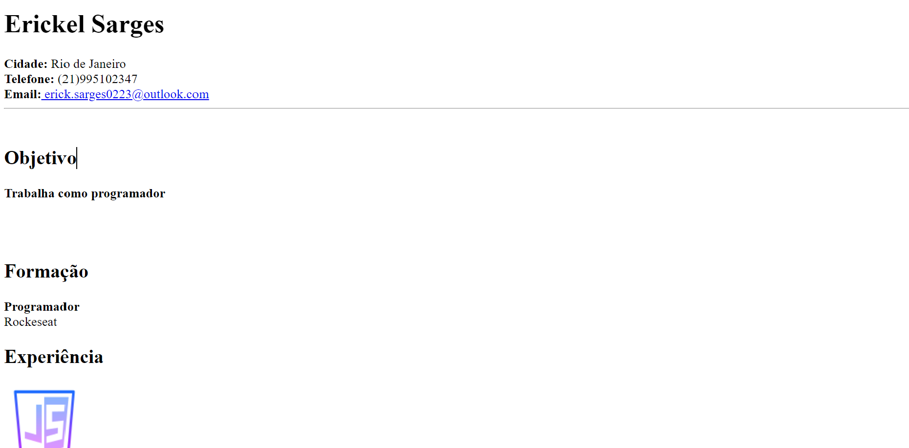
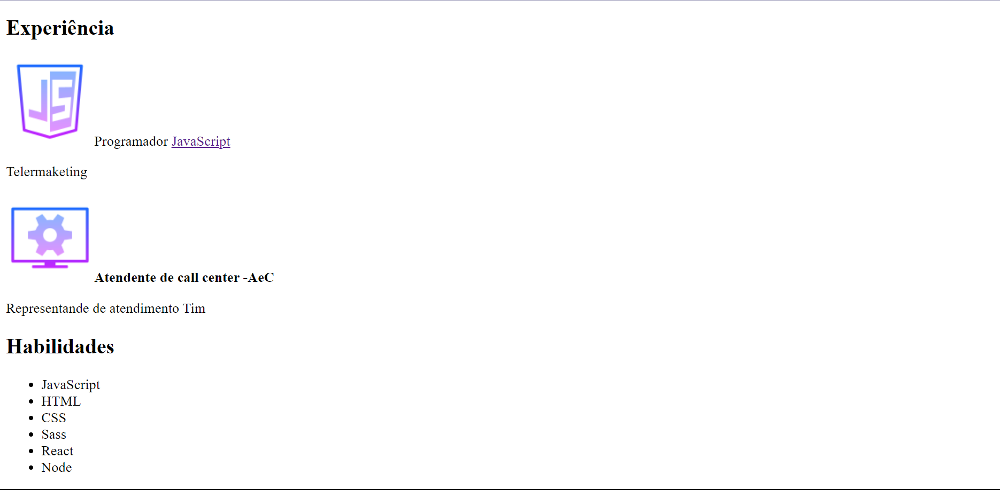

## Currículo

> Projeto próprio.

<b> Nesse projeto falo um pouco sobre minhas experiências</b>

<h2 align="center">
  Acesse o projeto clicando <a href="https://erickel-sarges.github.io/Testes/">AQUI</a>!
</h2>

<!--   -->

## :computer: Tecnologias utilizadas
O projeto foi desenvolvido utilizando as seguintes tecnologias:
- <b>HTML</b>
- <b>CSS</b>
- <b>SASS</b>
- <b>JavaScript</b>

